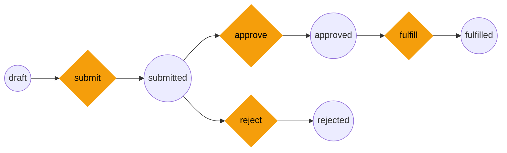

# SymFlow

[](https://github.com/vandetho/symflow/actions/workflows/ci.yaml)
[](https://www.npmjs.com/package/symflow)
[](https://socket.dev/npm/package/symflow)
[](https://packagephobia.com/result?p=symflow)
[](https://bundlephobia.com/package/symflow)
[](https://npm-stat.com/charts.html?package=symflow)

A Symfony-compatible workflow engine for TypeScript and Node.js. Design state machines and Petri net workflows with the same semantics as Symfony's Workflow component -- no PHP required.

The engine has **zero runtime dependencies** and runs anywhere JavaScript runs: Node.js backends, serverless functions, CLI tools, or the browser. The core engine is **~2.5 kB gzipped** -- the full bundle with all formats is under 8 kB.



> Design workflows visually with [SymFlowBuilder](https://symflowbuilder.com/editor) -- drag-and-drop states and transitions, test with the built-in simulator, then export to YAML, JSON, TypeScript, or Mermaid and run with `symflow` in production.

## Features

- **Two workflow types** -- `state_machine` (single active place) and `workflow` (Petri net with parallel states)
- **Symfony event order** -- `guard > leave > transition > enter > entered > completed > announce`
- **Subject-driven API** -- mirrors Symfony's `$workflow->apply($entity, 'submit')` pattern
- **Marking stores** -- `property` and `method` stores matching Symfony's options
- **Pluggable guards** -- bring your own expression evaluator
- **Weighted arcs** -- transitions can consume/produce multiple tokens per firing
- **Middleware** -- wrap `apply()` with composable before/after hooks (logging, transactions, metrics)
- **Validation** -- catches unreachable places, dead transitions, orphan places, invalid markings, invalid weights
- **Pattern analysis** -- detects AND-split, AND-join, OR-split, OR-join, XOR patterns
- **YAML / JSON / TypeScript / Mermaid / Graphviz** -- round-trip import and export for all formats
- **CLI** -- `symflow validate`, `symflow mermaid`, `symflow dot` from the command line
- **React Flow adapter** -- optional integration for visual editors

## Installation

```bash
npm install symflow
```

## Quick Start

```ts
import { WorkflowEngine, validateDefinition, type WorkflowDefinition } from "symflow/engine";

const definition: WorkflowDefinition = {
    name: "order",
    type: "state_machine",
    places: [
        { name: "draft" },
        { name: "submitted" },
        { name: "approved" },
        { name: "rejected" },
        { name: "fulfilled" },
    ],
    transitions: [
        { name: "submit", froms: ["draft"], tos: ["submitted"] },
        { name: "approve", froms: ["submitted"], tos: ["approved"] },
        { name: "reject", froms: ["submitted"], tos: ["rejected"] },
        { name: "fulfill", froms: ["approved"], tos: ["fulfilled"] },
    ],
    initialMarking: ["draft"],
};

const { valid, errors } = validateDefinition(definition);
if (!valid) throw new Error(errors.map((e) => e.message).join("\n"));

const engine = new WorkflowEngine(definition);

engine.getActivePlaces();        // ["draft"]
engine.getEnabledTransitions();  // [{ name: "submit", ... }]

if (engine.can("submit").allowed) {
    engine.apply("submit");
}

engine.getActivePlaces();  // ["submitted"]
```

## CLI

```bash
symflow validate workflow.yaml                    # validate a definition
symflow mermaid workflow.yaml -o diagram.mmd      # export Mermaid diagram
symflow dot workflow.yaml | dot -Tpng -o graph.png  # export DOT and render
```

Supports `.yaml`, `.yml`, `.json`, `.js`, `.ts` files. See [CLI docs](./docs/cli.md) for details.

## Subpath Exports

Import only what you need -- most have zero dependencies.

| Import               | Contents                                                                     | Extra deps             |
| -------------------- | ---------------------------------------------------------------------------- | ---------------------- |
| `symflow/engine`     | `WorkflowEngine`, `validateDefinition`, `analyzeWorkflow`, types             | none                   |
| `symflow/subject`    | `Workflow<T>`, `createWorkflow`, `propertyMarkingStore`, `methodMarkingStore` | none                  |
| `symflow/yaml`       | Symfony YAML import/export                                                   | `js-yaml`              |
| `symflow/json`       | JSON import/export                                                           | none                   |
| `symflow/typescript` | TypeScript codegen from a definition                                         | none                   |
| `symflow/mermaid`    | Mermaid `stateDiagram-v2` export                                             | none                   |
| `symflow/graphviz`   | Graphviz DOT digraph export                                                  | none                   |
| `symflow/types`      | `WorkflowMeta`, `TransitionListener`, defaults                               | none                   |
| `symflow/react-flow` | React Flow node/edge types, graph utilities                                  | `@xyflow/react` (peer) |
| `symflow`            | All of the above re-exported                                                 | all                    |

## Documentation

| Guide                                            | Description                                          |
| ------------------------------------------------ | ---------------------------------------------------- |
| [Getting Started](./docs/getting-started.md)     | Installation, first workflow, subpath imports         |
| [Engine API](./docs/engine-api.md)               | `WorkflowEngine`, events, guards, validation, pattern analysis |
| [Subject API](./docs/subject-api.md)             | `Workflow<T>`, marking stores, subject events        |
| [Weighted Arcs](./docs/weighted-arcs.md)         | `consumeWeight`, `produceWeight`, multi-token transitions |
| [Middleware](./docs/middleware.md)                | Composable lifecycle hooks, logging, transactions    |
| [CLI](./docs/cli.md)                             | `validate`, `mermaid`, `dot` commands                |
| [Persistence Formats](./docs/persistence-formats.md) | YAML, JSON, TypeScript, Mermaid, Graphviz, React Flow |

## Symfony Parity

**Matches:** `Definition`, `Marking`, `Transition`, `can()`, `apply()`, `getEnabledTransitions()`, event order, `state_machine` vs `workflow` semantics, `property` and `method` marking stores, pluggable guard evaluator.

**Not included:** `ExpressionLanguage` (bring your own via `guardEvaluator`).

## SymFlowBuilder

[SymFlowBuilder](https://symflowbuilder.com) is the visual editor companion for this package. Design workflows with drag-and-drop, simulate transitions, and export production-ready configs.

Try it at [symflowbuilder.com/editor](https://symflowbuilder.com/editor).

## Roadmap

### Done

- [x] `WorkflowEngine` with Symfony-compatible semantics
- [x] `state_machine` and `workflow` (Petri net) types
- [x] Event system (guard, leave, transition, enter, entered, completed, announce)
- [x] Pluggable guard evaluator
- [x] Subject-driven `Workflow<T>` API with marking stores
- [x] Validation and pattern analysis
- [x] YAML / JSON / TypeScript / Mermaid / Graphviz import/export
- [x] `!php/const` and `!php/enum` YAML tag support
- [x] React Flow adapter
- [x] CLI (`validate`, `mermaid`, `dot`)
- [x] Weighted arcs (`consumeWeight`, `produceWeight`)
- [x] Middleware system (wrap `apply()` lifecycle)

### Planned

- [ ] Expression language evaluator (built-in basic expression parser)
- [ ] Named sub-events (`workflow.{name}.guard.{transition}`)
- [ ] Workflow composition (nested workflows)
- [ ] Async transition support

## License

MIT
