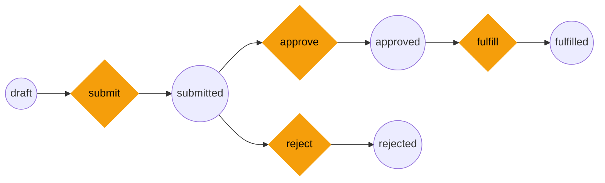

# SymFlow

[](https://github.com/vandetho/symflow/actions/workflows/ci.yaml)
[](https://www.npmjs.com/package/symflow)
[](https://npm-stat.com/charts.html?package=symflow)

A Symfony-compatible workflow engine for **TypeScript** and **Laravel/PHP**. Design state machines and Petri net workflows with the same semantics as Symfony's Workflow component.



> Design workflows visually with [SymFlowBuilder](https://symflowbuilder.com/editor) -- drag-and-drop states and transitions, test with the built-in simulator, then export and run in production.

## Packages

| Package | Language | Install | Docs |
|---------|----------|---------|------|
| **[symflow](./packages/ts/)** | TypeScript / Node.js | `npm install symflow` | [README](./packages/ts/docs/getting-started.md) |
| **[laraflow](./packages/laravel/)** | PHP 8.2+ / Laravel 11+ | `composer require vandetho/laraflow` | [README](./packages/laravel/README.md) |

Both packages implement the same workflow engine with full feature parity.

## Features

- **Two workflow types** -- `state_machine` (single active place) and `workflow` (Petri net with parallel states)
- **Symfony event order** -- `guard > leave > transition > enter > entered > completed > announce`
- **Subject-driven API** -- mirrors Symfony's `$workflow->apply($entity, 'submit')` pattern
- **Marking stores** -- `property` and `method` stores matching Symfony's options
- **Pluggable guards** -- bring your own expression evaluator
- **Weighted arcs** -- transitions can consume/produce multiple tokens per firing
- **Middleware** -- wrap `apply()` with composable before/after hooks
- **Validation** -- catches unreachable places, dead transitions, invalid weights
- **Pattern analysis** -- detects AND-split, AND-join, OR-split, XOR patterns
- **Import/Export** -- YAML (Symfony-compatible), JSON, TypeScript/PHP codegen, Mermaid, Graphviz DOT
- **CLI / Artisan commands** -- validate, export diagrams from the command line

## Quick Start

### TypeScript

```bash
npm install symflow
```

```ts
import { WorkflowEngine, validateDefinition } from "symflow/engine";

const definition = {
    name: "order",
    type: "state_machine",
    places: [{ name: "draft" }, { name: "submitted" }, { name: "approved" }],
    transitions: [
        { name: "submit", froms: ["draft"], tos: ["submitted"] },
        { name: "approve", froms: ["submitted"], tos: ["approved"] },
    ],
    initialMarking: ["draft"],
};

const engine = new WorkflowEngine(definition);
engine.apply("submit");
engine.getActivePlaces(); // ["submitted"]
```

### Laravel

```bash
composer require vandetho/laraflow
php artisan vendor:publish --tag=laraflow-config
```

```php
// config/laraflow.php
'workflows' => [
    'order' => [
        'type' => 'state_machine',
        'marking_store' => ['type' => 'property', 'property' => 'status'],
        'initial_marking' => ['draft'],
        'places' => ['draft', 'submitted', 'approved'],
        'transitions' => [
            'submit' => ['from' => 'draft', 'to' => 'submitted'],
            'approve' => ['from' => 'submitted', 'to' => 'approved'],
        ],
    ],
],
```

```php
use Laraflow\Facades\Laraflow;

$workflow = Laraflow::get('order');
$workflow->apply($order, 'submit');
```

Or use the Eloquent trait:

```php
use Laraflow\Eloquent\HasWorkflowTrait;

class Order extends Model
{
    use HasWorkflowTrait;

    protected function getDefaultWorkflowName(): string
    {
        return 'order';
    }
}

$order->applyTransition('submit');
$order->canTransition('approve'); // true/false
```

## CLI

```bash
# TypeScript
symflow validate workflow.yaml
symflow mermaid workflow.yaml -o diagram.mmd
symflow dot workflow.yaml | dot -Tpng -o graph.png

# Laravel
php artisan laraflow:validate workflow.yaml
php artisan laraflow:mermaid workflow.yaml --output=diagram.mmd
php artisan laraflow:dot workflow.yaml
```

## SymFlowBuilder

[SymFlowBuilder](https://symflowbuilder.com) is the visual editor companion. Design workflows with drag-and-drop, simulate transitions, and export production-ready configs.

Try it at [symflowbuilder.com/editor](https://symflowbuilder.com/editor).

## License

MIT
