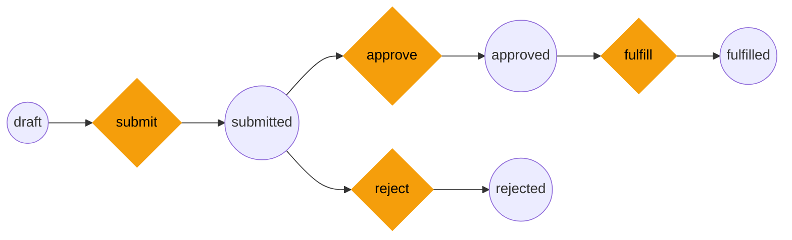
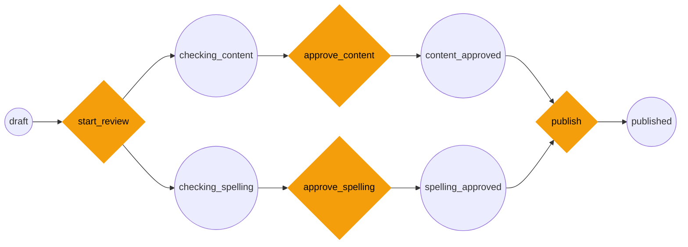
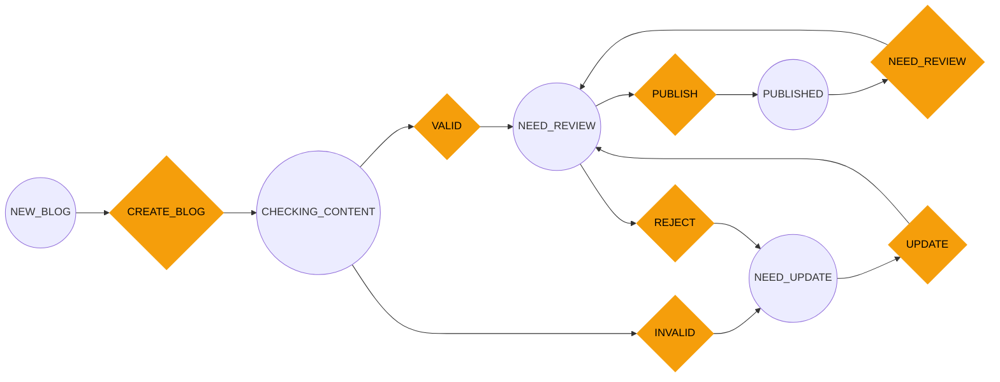

# SymFlow

A Symfony-compatible workflow engine for TypeScript and Node.js. Design state machines and Petri net workflows with the same semantics as Symfony's Workflow component — no PHP required.

The engine has **zero runtime dependencies** and runs anywhere JavaScript runs: Node.js backends, serverless functions, CLI tools, or the browser.



> Design workflows visually with [SymFlowBuilder](https://symflowbuilder.com/editor) — drag-and-drop states and transitions, test with the built-in simulator, then export to YAML, JSON, TypeScript, or Mermaid and run with `symflow` in production.

## Features

- **Two workflow types** — `state_machine` (single active place) and `workflow` (Petri net with parallel states)
- **Symfony event order** — `guard > leave > transition > enter > entered > completed > announce`
- **Subject-driven API** — mirrors Symfony's `$workflow->apply($entity, 'submit')` pattern
- **Marking stores** — `property` and `method` stores matching Symfony's options
- **Pluggable guards** — bring your own expression evaluator
- **Validation** — catches unreachable places, dead transitions, orphan places, invalid markings
- **Pattern analysis** — detects AND-split, AND-join, OR-split, OR-join, XOR patterns
- **YAML / JSON / TypeScript / Mermaid** — round-trip import and export for all formats, plus Mermaid `stateDiagram-v2` diagram export
- **React Flow adapter** — optional integration for visual editors

## Installation

```bash
npm install symflow
```

## Quick Start

```ts
import {
    WorkflowEngine,
    validateDefinition,
    type WorkflowDefinition,
} from "symflow/engine";

const definition: WorkflowDefinition = {
    name: "order",
    type: "state_machine",
    places: [
        { name: "draft" },
        { name: "submitted" },
        { name: "approved" },
        { name: "rejected" },
        { name: "fulfilled" },
    ],
    transitions: [
        { name: "submit", froms: ["draft"], tos: ["submitted"] },
        { name: "approve", froms: ["submitted"], tos: ["approved"] },
        { name: "reject", froms: ["submitted"], tos: ["rejected"] },
        { name: "fulfill", froms: ["approved"], tos: ["fulfilled"] },
    ],
    initialMarking: ["draft"],
};

// Validate first
const { valid, errors } = validateDefinition(definition);
if (!valid) throw new Error(errors.map((e) => e.message).join("\n"));

// Create engine and use it
const engine = new WorkflowEngine(definition);

engine.getActivePlaces();        // ["draft"]
engine.getEnabledTransitions();  // [{ name: "submit", ... }]

if (engine.can("submit").allowed) {
    engine.apply("submit");
}

engine.getActivePlaces();  // ["submitted"]
```

## Subpath Exports

Pick only the subpath you need — most have zero dependencies.

| Import                     | Contents                                             | Extra deps             |
| -------------------------- | ---------------------------------------------------- | ---------------------- |
| `symflow/engine`     | `WorkflowEngine`, `validateDefinition`, `analyzeWorkflow`, types | none        |
| `symflow/subject`    | `Workflow<T>`, `createWorkflow`, `propertyMarkingStore`, `methodMarkingStore` | none |
| `symflow/yaml`       | Symfony YAML import/export                           | `js-yaml`              |
| `symflow/json`       | JSON import/export                                   | none                   |
| `symflow/typescript` | TypeScript codegen from a definition                 | none                   |
| `symflow/mermaid`    | Mermaid `stateDiagram-v2` export                     | none                   |
| `symflow/types`      | `WorkflowMeta`, `TransitionListener`, defaults       | none                   |
| `symflow/react-flow` | React Flow node/edge types, graph utilities           | `@xyflow/react` (peer) |
| `symflow`            | All of the above re-exported                         | all                    |

## Engine API

### `WorkflowEngine`

```ts
import { WorkflowEngine } from "symflow/engine";

const engine = new WorkflowEngine(definition, {
    guardEvaluator: (expression, { marking, transition }) => {
        // return true to allow, false to block
        return true;
    },
});
```

| Method                       | Returns              | Description                                 |
| ---------------------------- | -------------------- | ------------------------------------------- |
| `getMarking()`               | `Marking`            | Current marking (place name to token count) |
| `setMarking(marking)`        | `void`               | Override the current marking                |
| `getInitialMarking()`        | `Marking`            | The initial marking from the definition     |
| `getActivePlaces()`          | `string[]`           | Places with token count > 0                 |
| `getEnabledTransitions()`    | `Transition[]`       | Transitions that can fire right now         |
| `can(transitionName)`        | `TransitionResult`   | Check if a transition can fire              |
| `apply(transitionName)`      | `Marking`            | Fire a transition (throws if blocked)       |
| `reset()`                    | `void`               | Reset to initial marking                    |
| `on(eventType, listener)`    | `() => void`         | Subscribe to events (returns unsubscribe)   |
| `getDefinition()`            | `WorkflowDefinition` | The underlying definition                   |

### `TransitionResult`

`can()` returns structured feedback:

```ts
const result = engine.can("approve");

if (!result.allowed) {
    for (const blocker of result.blockers) {
        console.log(blocker.code);    // "not_in_place" | "guard_blocked" | "unknown_transition" | "invalid_marking"
        console.log(blocker.message); // human-readable explanation
    }
}
```

## Events

The engine fires events in Symfony's exact order when `apply()` is called:

| Order | Event        | When                                          |
| ----- | ------------ | --------------------------------------------- |
| 1     | `guard`      | Checks if the transition is allowed           |
| 2     | `leave`      | Per source place, before tokens are removed   |
| 3     | `transition` | After tokens are removed from source places   |
| 4     | `enter`      | Per target place, before marking is updated   |
| 5     | `entered`    | After marking is updated                      |
| 6     | `completed`  | After the full transition is done             |
| 7     | `announce`   | Per newly enabled transition                  |

```ts
engine.on("entered", (event) => {
    console.log(event.type);          // "entered"
    console.log(event.transition);    // { name, froms, tos, guard? }
    console.log(event.marking);       // { draft: 0, submitted: 1, ... }
    console.log(event.workflowName);  // "order"
});

// Unsubscribe
const unsub = engine.on("guard", listener);
unsub();
```

## Guards

Attach guard expressions to transitions and provide an evaluator:

```ts
const definition: WorkflowDefinition = {
    name: "order",
    type: "state_machine",
    places: [{ name: "submitted" }, { name: "approved" }],
    transitions: [
        {
            name: "approve",
            froms: ["submitted"],
            tos: ["approved"],
            guard: "subject.total < 10000",
        },
    ],
    initialMarking: ["submitted"],
};

const engine = new WorkflowEngine(definition, {
    guardEvaluator: (expression, { marking, transition }) => {
        // Integrate any expression engine: expr-eval, jexl, custom logic
        if (expression === "subject.total < 10000") {
            return orderTotal < 10000;
        }
        return true;
    },
});

engine.can("approve");
// { allowed: false, blockers: [{ code: "guard_blocked", message: "..." }] }
```

## Validation

Catch structural problems before creating an engine:

```ts
import { validateDefinition } from "symflow/engine";

const result = validateDefinition(definition);

if (!result.valid) {
    for (const error of result.errors) {
        console.error(`[${error.type}] ${error.message}`);
    }
}
```

Detected issues:

| Error type                  | Description                                           |
| --------------------------- | ----------------------------------------------------- |
| `no_initial_marking`        | No initial marking defined                            |
| `invalid_initial_marking`   | Initial marking references a non-existent place       |
| `invalid_transition_source` | Transition `from` references a non-existent place     |
| `invalid_transition_target` | Transition `to` references a non-existent place       |
| `unreachable_place`         | Place cannot be reached from the initial marking (BFS)|
| `dead_transition`           | Transition can never fire (source places unreachable) |
| `orphan_place`              | Place has no incoming or outgoing transitions         |

## Pattern Analysis

Detect structural patterns in your workflow:

```ts
import { analyzeWorkflow } from "symflow/engine";

const analysis = analyzeWorkflow(definition);

// Transition patterns
analysis.transitions["start_review"].pattern;  // "and-split"
analysis.transitions["publish"].pattern;        // "and-join"

// Place patterns
analysis.places["review"].patterns;             // ["or-split"]
analysis.places["content_approved"].patterns;   // ["and-join"]
```

**Transition patterns:** `simple`, `and-split` (1 from, N to), `and-join` (N from, 1 to), `and-split-join` (N from, M to)

**Place patterns (workflow type):** `simple`, `or-split`, `or-join`, `and-split`, `and-join`

**Place patterns (state_machine type):** `simple`, `xor-split`, `xor-join`

## Subject-Driven API

For applications where workflow state lives on domain objects, the `Workflow<T>` class mirrors Symfony's `Workflow` service:

```ts
import { createWorkflow, propertyMarkingStore } from "symflow/subject";

interface Invoice {
    id: string;
    total: number;
    currentState: string | string[];
}

const workflow = createWorkflow<Invoice>(definition, {
    markingStore: propertyMarkingStore("currentState"),
    guardEvaluator: (expression, { subject, marking, transition }) => {
        if (expression === "subject.total < 10000") {
            return subject.total < 10000;
        }
        return true;
    },
});

const invoice: Invoice = { id: "inv_1", total: 500, currentState: "draft" };

workflow.can(invoice, "submit");     // { allowed: true, blockers: [] }
workflow.apply(invoice, "submit");   // reads + writes invoice.currentState
console.log(invoice.currentState);   // "submitted"

// Events include the subject
workflow.on("entered", (event) => {
    console.log(event.subject.id);        // "inv_1"
    console.log(event.transition.name);   // "submit"
});

// Get enabled transitions for a subject
workflow.getEnabledTransitions(invoice);  // [{ name: "approve", ... }, ...]
```

### Marking Stores

| Store                               | Symfony equivalent | How it works                                            |
| ----------------------------------- | ------------------ | ------------------------------------------------------- |
| `propertyMarkingStore("field")`     | `type: property`   | Reads/writes `subject.field` directly                   |
| `methodMarkingStore()`              | `type: method`     | Calls `subject.getMarking()` / `subject.setMarking(v)`  |
| `methodMarkingStore({ getter, setter })` | `type: method` | Custom method names                                    |

Implement `MarkingStore<T>` for custom storage (Prisma column, Redis, event-sourced aggregate, etc.).

## Parallel Workflows (Petri Net)

Use `type: "workflow"` to enable AND-split and AND-join patterns where multiple places are active simultaneously:



`start_review` is a single transition that forks into two parallel places. `publish` is a single transition that requires both paths to complete (AND-join).

```ts
const reviewWorkflow: WorkflowDefinition = {
    name: "article_review",
    type: "workflow",
    places: [
        { name: "draft" },
        { name: "checking_content" },
        { name: "checking_spelling" },
        { name: "content_approved" },
        { name: "spelling_approved" },
        { name: "published" },
    ],
    transitions: [
        { name: "start_review", froms: ["draft"], tos: ["checking_content", "checking_spelling"] },
        { name: "approve_content", froms: ["checking_content"], tos: ["content_approved"] },
        { name: "approve_spelling", froms: ["checking_spelling"], tos: ["spelling_approved"] },
        { name: "publish", froms: ["content_approved", "spelling_approved"], tos: ["published"] },
    ],
    initialMarking: ["draft"],
};

const engine = new WorkflowEngine(reviewWorkflow);

engine.apply("start_review");
engine.getActivePlaces();  // ["checking_content", "checking_spelling"]

engine.apply("approve_content");
engine.can("publish");     // { allowed: false } — spelling not approved yet

engine.apply("approve_spelling");
engine.can("publish");     // { allowed: true } — both paths complete
engine.apply("publish");
engine.getActivePlaces();  // ["published"]
```

Key difference between types:
- **`state_machine`**: `from: [a, b]` means OR — current place must be one of them
- **`workflow`**: `from: [a, b]` means AND — all listed places must have tokens

## Persistence Formats

All formats round-trip the same `{ definition, meta }` shape.

### YAML (Symfony config)

```ts
import { importWorkflowYaml, exportWorkflowYaml } from "symflow/yaml";

const { definition, meta } = importWorkflowYaml(yamlString);
const yaml = exportWorkflowYaml({ definition, meta });
```

### JSON

```ts
import { importWorkflowJson, exportWorkflowJson } from "symflow/json";

const { definition, meta } = importWorkflowJson(jsonString);
const json = exportWorkflowJson({ definition, meta, indent: 2 });
```

### TypeScript codegen

Emits a typed module you can write to disk and import like any other source file:

```ts
import { exportWorkflowTs } from "symflow/typescript";

const ts = exportWorkflowTs({
    definition,
    meta,
    exportName: "order",        // -> orderDefinition, orderMeta
    importFrom: "symflow",
});
fs.writeFileSync("workflows/order.ts", ts);
```

### Mermaid diagram

Generates a `stateDiagram-v2` diagram you can paste into GitHub Markdown, Notion, or any Mermaid renderer:

```ts
import { exportWorkflowMermaid } from "symflow/mermaid";

const mmd = exportWorkflowMermaid({ definition, meta });
// stateDiagram-v2
//     direction LR
//     [*] --> draft
//     draft --> submitted : submit
//     submitted --> approved : approve
//     ...
```

## React Flow Adapter (optional)

For visual editors built with React Flow:

```ts
import {
    importWorkflowYamlToGraph,
    exportGraphToYaml,
    exportGraphToJson,
    exportGraphToTs,
    exportGraphToMermaid,
    autoLayoutNodes,
    buildDefinition,
} from "symflow/react-flow";

// Import a Symfony YAML config into React Flow nodes/edges
const { nodes, edges, meta } = importWorkflowYamlToGraph(yamlString);

// Export back
const yaml = exportGraphToYaml({ nodes, edges, meta });
const json = exportGraphToJson({ nodes, edges, meta });
const ts = exportGraphToTs({ nodes, edges, meta, exportName: "myFlow" });
const mmd = exportGraphToMermaid({ nodes, edges, meta });
```

Requires `@xyflow/react` as a peer dependency.

## Real-World Example: Symfony Article Workflow

Here is the classic Symfony article review workflow — a real-world Petri net with parallel approval paths:

```yaml
framework:
    workflows:
        article_workflow:
            type: 'workflow'
            audit_trail:
                enabled: true
            marking_store:
                type:     'method'
                property: 'marking'
            supports:
                - App\Entity\Article
            initial_marking: NEW_ARTICLE
            places:
                NEW_ARTICLE:
                CHECKING_CONTENT:
                    metadata:
                        bg_color: ORANGE
                CONTENT_APPROVED:
                    metadata:
                        bg_color: DeepSkyBlue
                CHECKING_SPELLING:
                    metadata:
                        bg_color: ORANGE
                SPELLING_APPROVED:
                    metadata:
                        bg_color: DeepSkyBlue
                PUBLISHED:
                    metadata:
                        bg_color: Lime
            transitions:
                CREATE_ARTICLE:
                    from:
                        - NEW_ARTICLE
                    to:
                        - CHECKING_CONTENT
                        - CHECKING_SPELLING
                APPROVE_SPELLING:
                    from:
                        - CHECKING_SPELLING
                    to:
                        - SPELLING_APPROVED
                APPROVE_CONTENT:
                    from:
                        - CHECKING_CONTENT
                    to:
                        - CONTENT_APPROVED
                PUBLISH:
                    from:
                        - CONTENT_APPROVED
                        - SPELLING_APPROVED
                    to:
                        - PUBLISHED
```

Import and run it with symflow:

```ts
import { readFileSync } from "fs";
import { importWorkflowYaml } from "symflow/yaml";
import { WorkflowEngine } from "symflow/engine";
import { validateDefinition } from "symflow/engine";

const yaml = readFileSync("article_workflow.yaml", "utf8");
const { definition } = importWorkflowYaml(yaml);

// Validate
const { valid, errors } = validateDefinition(definition);

// Run
const engine = new WorkflowEngine(definition);
engine.apply("CREATE_ARTICLE");
engine.getActivePlaces(); // ["CHECKING_CONTENT", "CHECKING_SPELLING"]

engine.apply("APPROVE_CONTENT");
engine.apply("APPROVE_SPELLING");
engine.apply("PUBLISH");
engine.getActivePlaces(); // ["PUBLISHED"]
```

This is Symfony's classic article review workflow. `CREATE_ARTICLE` is an AND-split that forks into parallel content and spelling checks. `PUBLISH` is an AND-join that requires both approvals before the article can be published.

## State Machine Example: Blog Publishing

Not every workflow needs parallel states. This blog publishing flow uses `type: state_machine` — exactly one state active at a time, with branching paths for approval and rejection.



This workflow uses Symfony's `!php/const` YAML tags to reference PHP constants. The symflow importer resolves them automatically — `!php/const App\Workflow\State\BlogState::NEW_BLOG` becomes `"NEW_BLOG"`.

```ts
import { readFileSync } from "fs";
import { importWorkflowYaml } from "symflow/yaml";
import { WorkflowEngine } from "symflow/engine";

const yaml = readFileSync("blog_event.yaml", "utf8");
const { definition } = importWorkflowYaml(yaml);
const engine = new WorkflowEngine(definition);

// Happy path
engine.apply("CREATE_BLOG");
engine.apply("VALID");
engine.apply("PUBLISH");
engine.getActivePlaces(); // ["PUBLISHED"]

// Unpublish and update
engine.apply("NEED_REVIEW");
engine.apply("REJECT");
engine.apply("UPDATE");
engine.getActivePlaces(); // ["NEED_REVIEW"]
```

## SymFlowBuilder

[SymFlowBuilder](https://symflowbuilder.com) is the visual editor companion for this package. Use it to:

- **Design** workflows with drag-and-drop on an interactive canvas
- **Simulate** — step through transitions, toggle guards, watch events fire
- **Export** — generate production-ready Symfony YAML, JSON, or TypeScript
- **Import** — paste existing Symfony YAML and edit it visually

Workflows designed in SymFlowBuilder can be exported and used directly with `symflow`:

```ts
import { WorkflowEngine } from "symflow/engine";
import { importWorkflowYaml } from "symflow/yaml";

// Paste the YAML exported from SymFlowBuilder
const { definition } = importWorkflowYaml(yamlFromSymFlowBuilder);
const engine = new WorkflowEngine(definition);
```

Try it at [symflowbuilder.com/editor](https://symflowbuilder.com/editor).

## Symfony Parity

**Matches:** `Definition`, `Marking`, `Transition`, `can()`, `apply()`, `getEnabledTransitions()`, event order (`guard > leave > transition > enter > entered > completed > announce`), `state_machine` vs `workflow` semantics, `property` and `method` marking stores, pluggable guard evaluator.

**Not included:** `ExpressionLanguage` (bring your own via `guardEvaluator`), Graphviz dumper, weighted arcs.

## Roadmap

### Done

- [x] `WorkflowEngine` with Symfony-compatible semantics
- [x] `state_machine` and `workflow` (Petri net) types
- [x] Event system (guard, leave, transition, enter, entered, completed, announce)
- [x] Pluggable guard evaluator
- [x] Subject-driven `Workflow<T>` API with marking stores
- [x] `propertyMarkingStore` and `methodMarkingStore`
- [x] Validation (unreachable places, dead transitions, orphan places)
- [x] Pattern analysis (AND-split, AND-join, OR-split, XOR)
- [x] YAML import/export (Symfony-compatible)
- [x] JSON import/export
- [x] TypeScript codegen export
- [x] `!php/const` and `!php/enum` YAML tag support
- [x] React Flow adapter (graph ↔ definition)
- [x] Mermaid `stateDiagram-v2` diagram export

### Planned

- [ ] Expression language evaluator (built-in basic expression parser)
- [ ] Weighted arcs (token counts > 1)
- [ ] Named sub-events (`workflow.{name}.guard.{transition}`)
- [ ] Graphviz / DOT export
- [ ] Workflow composition (nested workflows)
- [ ] Async transition support
- [ ] Middleware / plugin system for custom event handling

## License

MIT
