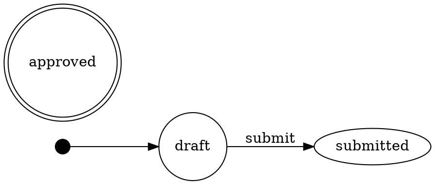

# Persistence Formats

symflow supports importing and exporting workflow definitions in multiple formats. All formats operate on the same `{ definition, meta }` shape.

## YAML (Symfony-compatible)

The YAML format is compatible with Symfony's `framework.workflows` configuration. symflow handles Symfony-specific features like `!php/const` and `!php/enum` tags.

### Import

```ts
import { importWorkflowYaml } from "symflow/yaml";

const yamlString = fs.readFileSync("workflow.yaml", "utf8");
const { definition, meta } = importWorkflowYaml(yamlString);
```

Accepted formats:
- Full Symfony config: `framework.workflows.{name}.*`
- Named workflow: `{name}.places` / `{name}.transitions`
- Bare definition: top-level `places` and `transitions`

### Export

```ts
import { exportWorkflowYaml } from "symflow/yaml";

const yaml = exportWorkflowYaml({ definition, meta });
fs.writeFileSync("workflow.yaml", yaml);
```

Output is a valid Symfony `framework.workflows` configuration block.

### Weighted Arcs in YAML

```yaml
transitions:
    manufacture:
        from: raw_materials
        to: components
        consumeWeight: 3
        produceWeight: 2
```

Weights are omitted when they equal the default (`1`), keeping the YAML concise.

## JSON

### Import

```ts
import { importWorkflowJson } from "symflow/json";

const { definition, meta } = importWorkflowJson(jsonString);
```

The JSON must have `definition` and `meta` top-level keys. The `definition` must include `places` and `transitions` arrays.

### Export

```ts
import { exportWorkflowJson } from "symflow/json";

const json = exportWorkflowJson({ definition, meta, indent: 2 });
```

All transition fields (including `consumeWeight` and `produceWeight`) are preserved automatically via `JSON.stringify`.

## TypeScript Codegen

Generates a typed `.ts` module with named exports:

```ts
import { exportWorkflowTs } from "symflow/typescript";

const ts = exportWorkflowTs({
    definition,
    meta,
    exportName: "order",      // produces orderDefinition and orderMeta
    importFrom: "symflow",    // import path for types
});

fs.writeFileSync("workflows/order.ts", ts);
```

The generated file can be imported directly:

```ts
import { orderDefinition, orderMeta } from "./workflows/order";
```

## Mermaid

Generates a `stateDiagram-v2` diagram for GitHub Markdown, Notion, or any Mermaid renderer.

```ts
import { exportWorkflowMermaid } from "symflow/mermaid";

const mmd = exportWorkflowMermaid({ definition, meta });
```

Output:

```
stateDiagram-v2
    direction LR
    [*] --> draft
    draft --> submitted : submit
    submitted --> approved : approve
    approved --> [*]
```

Features:
- Place descriptions from metadata
- Guard expressions shown in brackets: `submit [is_granted("ROLE_USER")]`
- Weighted arcs shown as `(consume:produce)`: `manufacture (3:2)`
- Final states auto-detected (no outgoing transitions)

## Graphviz DOT

Generates a `digraph` for Graphviz, `dot`, or any DOT-compatible tool.

```ts
import { exportWorkflowDot } from "symflow/graphviz";

const dot = exportWorkflowDot({ definition, meta });
```

Output:



Features:
- Final states rendered as double circles
- AND-split/join transitions use intermediate rectangle nodes
- Guard expressions and weights displayed in labels
- Weighted arcs on AND-split/join edges show per-arc weights

### Rendering

```bash
# Render to PNG
symflow dot workflow.yaml | dot -Tpng -o graph.png

# Render to SVG
symflow dot workflow.yaml | dot -Tsvg -o graph.svg

# Render to PDF
symflow dot workflow.yaml | dot -Tpdf -o graph.pdf
```

## React Flow Adapter

For visual editors built with [React Flow](https://reactflow.dev). Requires `@xyflow/react` as a peer dependency.

```ts
import {
    importWorkflowYamlToGraph,
    exportGraphToYaml,
    exportGraphToJson,
    exportGraphToTs,
    exportGraphToMermaid,
    exportGraphToDot,
    autoLayoutNodes,
    buildDefinition,
} from "symflow/react-flow";

// Import YAML into React Flow nodes/edges
const { nodes, edges, meta } = importWorkflowYamlToGraph(yamlString);

// Export from React Flow graph
const yaml = exportGraphToYaml({ nodes, edges, meta });
const json = exportGraphToJson({ nodes, edges, meta });
const ts = exportGraphToTs({ nodes, edges, meta, exportName: "myFlow" });
const mmd = exportGraphToMermaid({ nodes, edges, meta });
const dot = exportGraphToDot({ nodes, edges, meta });
```

The adapter supports two node types:
- `state` (`StateNodeData`) -- workflow places
- `transition` (`TransitionNodeData`) -- workflow transitions with guard, metadata, and weights

`TransitionNodeData` includes `consumeWeight` and `produceWeight` fields that are passed through to the workflow definition via `buildDefinition()`.
